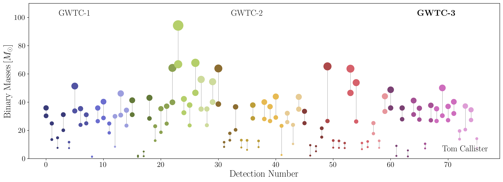
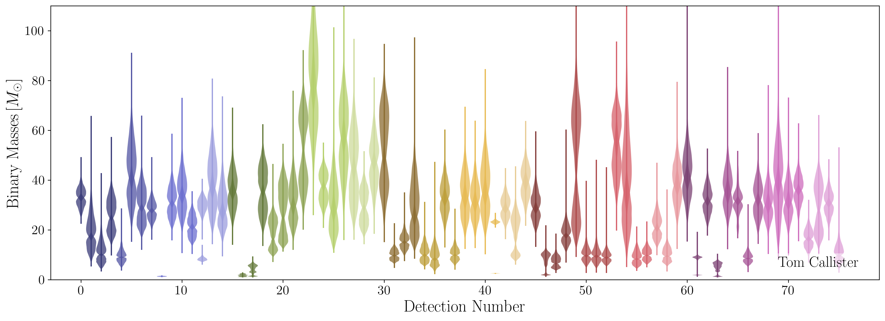
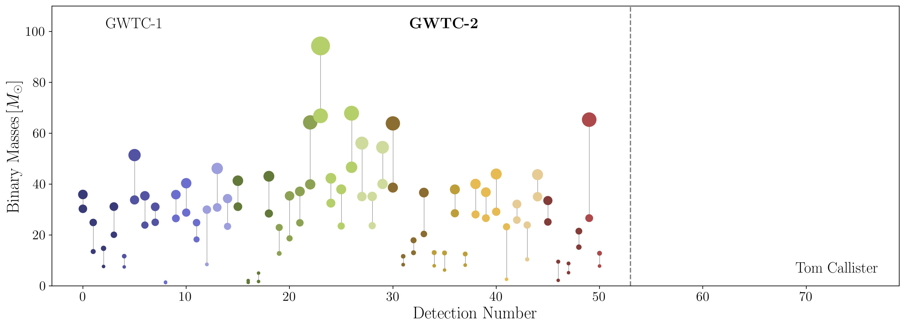
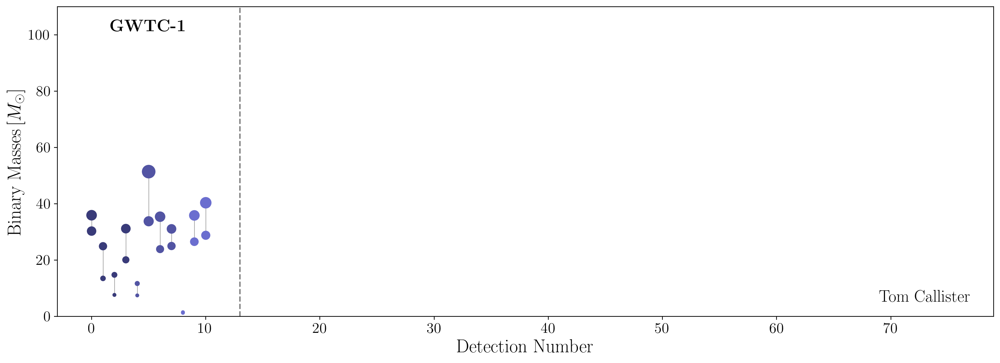

# cbc-landscape

Plots illustrating the "landscape" of CBC detections through the GWTC-3 catalog, produced by the LIGO-Virgo-KAGRA Collaboration following their O3b observing run.

### GWTC-3

### An "honest" GWTC-3

### GWTC-2

### GWTC-1

